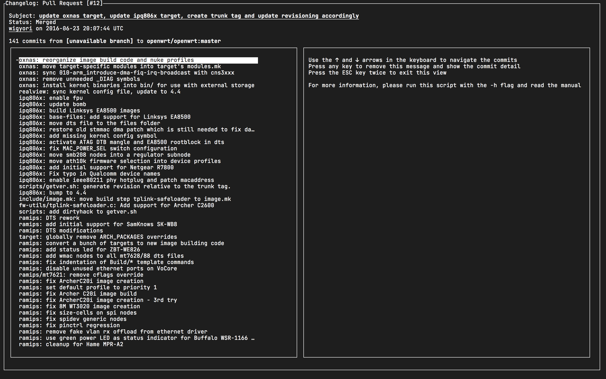

# Capstone Project: Ruby: Changelog Scraper
> A `git` changelog scraper can retrieve information from changelogs, such as merge requests from git websites.



A capstone project is the closing project that students will solo-perform. Its goal is to assess the student's technical and professional skills from the course that it is closing. For this project, the student should develop a web scraper built with Ruby and Ruby Gems.

## Design Considerations
### Object-oriented
This project is fully object-oriented, making usage of concepts such as:
- Mixins: the `Printer` and `Scraper` classes are the core functionality
- Factories: mixins  used to generate different types of `Printer`s or `Scraper`s on-demand
- Inheritance: for the git objects, such as `Message`s, `MergeRequest`s and `Commit`s
- [SOLID](https://www.c-sharpcorner.com/article/solid-architectural-pattern-with-real-time-example/) by design

### Extensible
The implementation of the [Factory](https://www.oodesign.com/factory-pattern.html) pattern allows developers to implement more scraper backends or printer frontends quickly.
- All of the core parts are modular
- No business logic in the main file
- Built using the [MVC](https://dotnet.microsoft.com/apps/aspnet/mvc) pattern to avoid coupling
- [Extensible](http://whats-in-a-game.com/coding-for-the-future-readability-and-extensibility/) by design

### Production-ready
Currently, the project is production-ready. The high-quality, readable, and modular code allows to quickly pinpoint bugs in the deployed code and fix them with ease. The code is well-guarded against the most common mistakes. It provides useful information about the errors that users may face.
- Easy to follow and read code
- [Modular](https://www.geeksforgeeks.org/effective-modular-design-in-software-engineering/) by desing
- Low level of [coupling](https://gamedevelopment.tutsplus.com/tutorials/quick-tip-the-oop-principle-of-coupling--gamedev-1935)
- Contact information in the program's help
- Ability to run the program in debug mode, allowing maintainers to debug the code with ease

## Built With
- [Ruby](https://www.ruby-lang.org/en/)
- NoTengoBattery's `Blessings` module
- [Gems](https://rubygems.org/)
  - [curses](https://linux.die.net/man/3/curses)
  - [nokogiri](https://nokogiri.org/)
  - [optparse](https://github.com/ruby/optparse)
  - [rspec](https://rspec.info/)

## Live Demo
[](https://repl.it/@NoTengoBattery/changelog-scraper#README.md)

## Documentation
A [manpage](https://wiki.archlinux.org/index.php/Man_page)-like Markdown document is available [here](./doc/README.md).


## Getting Started
You have two options for using this program: running it locally or running it from the live demo.

### Preparing the local environment
For running this program locally, you need to:
- [Install Ruby](https://www.ruby-lang.org/en/downloads/)
- [Install git](https://git-scm.com/book/en/v2/Getting-Started-Installing-Git)
> Note: as discussed below, downloading the source code without `git` is possible.

Once Ruby is installed, get a copy of this project by:
- Cloning the repository using `git`
  * `git clone https://github.com/NoTengoBattery/changelog-scraper.git`
- Downloading a zip with the source code
  * Click [here](https://github.com/NoTengoBattery/changelog-scraper/archive/master.zip) to download a copy of the stable branch
  * Click [here](https://github.com/NoTengoBattery/changelog-scraper/archive/develop.zip) to download a copy of the development branch
  * Once  downloaded, extract it in a place with easy access to a terminal
> This project does not need to be compiled. It only needs the Ruby interpreter.

Once Ruby is installed, and you have a copy of the source code, open the terminal and navigate to the folder where the code is:
- For Windows users, check [this](https://www.technoloxy.com/tutorials/cmd-navigate-view-run/) article.
- For UNIX/UNIX-like users such as Linux and macOS users, check [this](https://swcarpentry.github.io/shell-novice/02-filedir/index.html) article.
> Information about executing files is available inside the articles.

Install the Gems by running `bundle install`. You may need to provide your user password. For more information about Ruby's `bundle`, check [here](https://bundler.io/man/bundle-install.1.html).

### Preparing *repl.it*
If you are running this program inside the live demo:
- Click the green `Run` button centered at the top
- Verify that the output shows no errors
- Click the `Shell` tab in the right panel
> The `Run` button will install any missing Gem and run a default demo command. The output of that command shows the *raw* result intended to be piped to other tools, not to be read by humans.

### Running
By following the steps in either the live demo or in the local environment, you should execute the program. There are three options.

For all of the three, you need a valid URL. If you don't know what URL to use, try this one: `https://github.com/NoTengoBattery/changelog-scraper/pull/1`.

In the following commands, replace `[url]` with the actual URL to test. You may need to add a `./` in front of the executable file name. Please refer to the articles about navigating the file system in the terminal.
- Run the production version by running `changelog-scraper -v -u [url]`
- Run the development version by running `develop.rb -v -u [url]`
- Run the tests by running `test.rb`

### Demos
#### Piping the output to `awk` to format the output:
```sh
changelog-scraper -u https://github.com/NoTengoBattery/changelog-scraper/pull/1 -q | awk -F'\\x1d' '{printf "#%3d:\t%s\n", $2 + 1, $3}'
```

For more information about the usage, refer to the manual page.

## Authors

👤 **Oever González**

- GitHub: [@NoTengoBattery](https://github.com/NoTengoBattery)
- Twitter: [@NoTengoBattery](https://twitter.com/NoTengoBattery)
- LinkedIn: [Oever González](https://linkedin.com/in/NoTengoBattery)

## 🤝 Contributing

Contributions, issues, and feature requests are welcome!

Feel free to check the [issues page](https://github.com/NoTengoBattery/changelog-scraper/issues).

## Show your support

Give a ⭐️ if you like this project!

## 📝 License

This project is [X11](https://spdx.org/licenses/X11.html) licensed.
