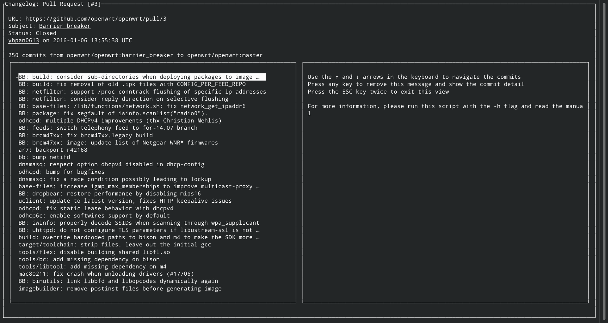

# Ruby: Changelog Scraper
> A `git` changelog scraper that can retrieve information from changelogs, such as merge/pull requests, from git websites such as GitHub.



An extensible, hackeable web scraper designed to show information from git websites such as GitHub. It acts as an standard UNIX tool and can be used as a pipe generator or as an interactive view.

## Built With
- [Ruby](https://www.ruby-lang.org/en/)
- NoTengoBattery's `Blessings` module
- [Gems](https://rubygems.org/)
  - [curses](https://linux.die.net/man/3/curses)
  - [nokogiri](https://nokogiri.org/)
  - [optparse](https://github.com/ruby/optparse)
  - [rspec](https://rspec.info/)

## Live Demo
[](https://repl.it/@NoTengoBattery/changelog-scraper#README.md)

## Documentation
A [manpage](https://wiki.archlinux.org/index.php/Man_page)-like Markdown document is available [here](./doc/README.md). This documentation only covers the production version.

> If you are on *repl.it*, **please click [here](#doc/README.md)**.

## Getting Started
You have two options for using this program: running it locally or running it from the live demo.

### Preparing the local environment
For running this program locally, you need to:
- [Install Ruby](https://www.ruby-lang.org/en/downloads/)
- [Install git](https://git-scm.com/book/en/v2/Getting-Started-Installing-Git)

> Note: as discussed below, downloading the source code without `git` is possible.

Once Ruby is installed, get a copy of this project by:
- Cloning the repository using `git`
  * `git clone https://github.com/NoTengoBattery/changelog-scraper.git`
- Downloading a zip with the source code
  * Click [here](https://github.com/NoTengoBattery/changelog-scraper/archive/master.zip) to download a copy of the stable branch
  * Click [here](https://github.com/NoTengoBattery/changelog-scraper/archive/develop.zip) to download a copy of the development branch
  * Once  downloaded, extract it in a place with easy access to a terminal

Once Ruby is installed, and you have a copy of the source code, open the terminal and navigate to the folder where the code is:
- For Windows users, check [this](https://www.technoloxy.com/tutorials/cmd-navigate-view-run/) article.
- For UNIX/UNIX-like users such as Linux and macOS users, check [this](https://swcarpentry.github.io/shell-novice/02-filedir/index.html) article.

Install the Gems by running `bundle install`. You may need to provide your user password. For more information about Ruby's `bundle`, check [here](https://bundler.io/man/bundle-install.1.html).

### Preparing *repl.it*
If you are running this program inside the live demo:
- Click the green `Run` button centered at the top
- Verify that the output shows no errors
- Click the `Shell` tab in the right panel

> The `Run` button will install any missing Gem and run a default demo command. For the interactive view **use the Shell tab, because the Console view does not display it correctly**.

### Running
By following the steps in either the live demo or in the local environment, you should execute the program. There are three options.

For all of the three, you need a valid URL. If you don't know what URL to use, try this one: `https://github.com/NoTengoBattery/changelog-scraper/pull/10`.

In the following commands, replace `[url]` with the actual URL to test. You may need to add a `./` in front of the executable file name. Please refer to the articles about navigating the file system in the terminal.
- Run the production version by running `changelog-scraper -u [url]`, `./changelog-scraper -u [url]` or `bundle exec changelog-scraper -u [url]`
- Run the development version by running `develop.rb -u [url]`, `./develop.rb -u [url]` or `bundle exec develop.rb -u [url]`
- Run the tests by running `bundle exec rspec`

> **Warning**: for Windows users using the native Ruby installer, the interactive view may not work because of Windows' poor support for `curses`. However, if you are using WSL or MinGW it will work flawlessly. For WSL and native Ubuntu, please make sure that you have the following packages: `build-essentials git libncurses-dev libncursesw5-dev ruby ruby-bundler ruby-dev`.

### Demos
#### Piping the output to `awk` to format the output (with index):
```shell
changelog-scraper -p pipe -q -u https://github.com/NoTengoBattery/changelog-scraper/pull/10 | awk -F'\\x1d' '{printf "#%3d:\t%s\n", $2 + 1, $3}'
```
#### Piping the output to `awk` to format the output (as a bullet list):
```shell
changelog-scraper -p pipe -q -u https://github.com/NoTengoBattery/changelog-scraper/pull/10 | awk -F'\\x1d' '{printf "  * %s\n", $3}'
```

**[!] REMEBER**: the pipe output is not designed to be read by humans, that's why an `awk` script is needed to format the output.
> **Warning**: `awk` is not available in Windows, and is not included in the native installed for Ruby. It is available on WSL and MinGW.

#### Showing the interactive view
```shell
changelog-scraper -u https://github.com/NoTengoBattery/changelog-scraper/pull/10
```

For more information about the usage, refer to the manual page.

## Authors

👤 **Oever González**

- GitHub: [@NoTengoBattery](https://github.com/NoTengoBattery)
- Twitter: [@NoTengoBattery](https://twitter.com/NoTengoBattery)
- LinkedIn: [Oever González](https://linkedin.com/in/NoTengoBattery)

## 🤝 Contributing

Contributions, issues, and feature requests are welcome!

Feel free to check the [issues page](https://github.com/NoTengoBattery/changelog-scraper/issues).

## Show your support

Give a ⭐️ if you like this project!

## 📝 License

This project is [X11](https://spdx.org/licenses/X11.html) licensed.
